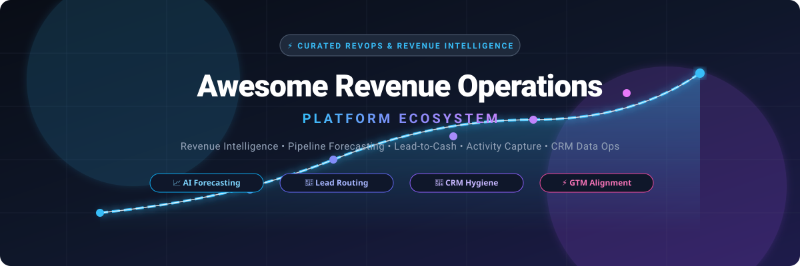

<p align="center">
  
</p>

# 🚀 Awesome Revenue Operations Platform Ecosystem

<p align="center">
  <a href="https://github.com/ishandutta2007/Awesome-Awesome-Awesome"></a>
  <a href="https://discord.gg/jc4xtF58Ve"></a>
  <a href="https://github.com/ishandutta2007/Awesome-Revenue-Operations-Platform/stargazers"></a>
  <a href="https://github.com/ishandutta2007/Awesome-Revenue-Operations-Platform/network/members"></a>
  <a href="https://github.com/ishandutta2007/Awesome-Revenue-Operations-Platform/blob/main/LICENSE"></a>
  <a href="https://github.com/ishandutta2007"></a>
</p>

---

**A curated directory of SaaS products & open-source GitHub projects for modern Revenue Operations (RevOps).**  
*Covering Revenue Intelligence, Predictive Pipeline Forecasting, Lead-to-Account Routing, CRM Data Hygiene, Automated Activity Capture, GTM Alignment, and Lead-to-Cash Automation.*

📅 **Last updated: September 2026**

---

## 🔍 Overview & SEO Highlights

**Revenue Operations (RevOps)** aligns Marketing, Sales, Customer Success, and Finance into a single, cohesive revenue engine. Modern RevOps teams rely on sophisticated platforms to eliminate data silos, automate lead-to-cash handoffs, improve pipeline visibility, ensure forecast reliability, and clean CRM data continuously.

This repository catalogs:
- 🏢 **Enterprise SaaS Platforms**: Industry-leading revenue intelligence, activity logging, predictive deal scoring, and quota/territory planning platforms.
- 💻 **Open-Source GitHub Foundations**: Self-hostable CRMs, workflow orchestrators, data pipelines (reverse-ETL/dbt), notifications, and BI analytics tools that empower engineering-led RevOps teams.

---

## 📑 Table of Contents

- [🏢 SaaS/Hosted Platforms](#-saashosted-platforms)
- [💻 Open-Source GitHub Projects](#-open-source-github-projects)
- [🏗️ Architecture & Custom RevOps Frameworks](#️-architecture--custom-revops-frameworks)
- [📈 Star History](#-star-history)
- [🤝 How to Contribute](#-how-to-contribute)
- [⚠️ Disclaimer](#️-disclaimer)

---

## 🏢 SaaS/Hosted Platforms

> 📊 **Market Size & Sector Dynamics**: The global Revenue Operations (RevOps) and Revenue Intelligence software market is valued at approximately **$3.8B–$4.5B (2025–2026)** and is projected to expand beyond **$12.5B+ by 2032** at a robust CAGR of **~19–21%**. The sector is **moderately fragmented**: while foundational systems of record are dominated by CRM mega-vendors (Salesforce and HubSpot), specialized revenue intelligence, automated activity capture, and orchestration platforms (Clari, People.ai, LeanData) retain strong competitive moats and distinct enterprise deployments, resisting a simple "winner-take-all" outcome.

The table below is sorted in **descending order by company size** (market capitalization or latest enterprise valuation / revenue):

| Platform | Company Size (Valuation / Revenue) | Description | Starting Pricing | Free Tier / Trial Limits |
| :--- | :--- | :--- | :--- | :--- |
| **[Salesforce Revenue Intelligence](https://www.salesforce.com/products/sales-cloud/pricing/)** | **~$280B+ Market Cap**<br>(~$38.0B FY26 Revenue, NYSE: CRM) | Embedded pipeline inspection, AI forecasting, and unified CRM Analytics built into Sales Cloud and Einstein. | Starts at **$220/user/mo** (billed annually; requires Sales Cloud Enterprise or Unlimited); **$250/user/mo** with Tableau Explorer | **No free-forever tier**; offers a **30-day free trial** via Salesforce Sales Cloud trial org (includes full pipeline inspection & Einstein intelligence access; or perpetual Developer Edition org limited to 5MB non-production data). |
| **[HubSpot Operations Hub](https://www.hubspot.com/products/operations)** | **~$28B–$32B Market Cap**<br>(~$2.6B Annual Revenue, NYSE: HUBS) | Native RevOps data synchronization, data curation, and programmable workflow automation embedded in HubSpot CRM. | **Free tier ($0)**; Starter tier starts at **$15–$20/seat/mo** ($180/yr billed annually); Professional tier starts at **$720–$800/mo** | **Free-forever plan** limited to up to 2 users, default field mappings, two-way sync for select apps, 1,000 marketing contacts, and 1 automated action per workflow (also offers 14-day Professional trial). |
| **[Clari](https://www.clari.com/)** | **$2.6B Valuation**<br>(~$450M Combined ARR post-merger) | Category-defining enterprise revenue platform for pipeline inspection, AI forecasting, and revenue orchestration (includes Clari Copilot). | Starts at **~$120/user/mo** (Clari Copilot standalone) or **~$100–$133/user/mo** ($1,200/user/yr billed annually; enterprise platform minimums ~$15k–$25k/yr) | **No free-forever tier**; offers a **14-day sales-guided proof-of-concept (POC) free trial** upon demo qualification, limited to an agreed evaluation seat count and test workspace. |
| **[People.ai](https://www.people.ai/)** | **$1.1B Valuation**<br>(~$60M Estimated ARR, $200M raised) | Enterprise revenue intelligence platform that automatically captures sales activities (emails, calendar meetings) and maps them into CRM records. | Starts at **~$50–$75/user/mo** (billed annually; enterprise annual platform contracts typically start around $23,000–$28,000/yr) | **No free-forever tier**; offers a **14-day sales-approved POC sandbox trial**, limited to a defined pilot group of sales reps and read-only CRM activity matching. |
| **[LeanData](https://www.leandata.com/)** | **~$250M–$450M Valuation**<br>(~$25M ARR, $42M+ total raised) | Salesforce-native lead-to-account matching, automated lead routing, and complex B2B GTM revenue orchestration. | Starts at **~$39–$49/user/mo** (billed annually for Standard routing; typical minimum annual platform contracts start around $12,000–$15,000/yr) | **No free-forever tier**; offers a **14-day to 30-day POC sandbox trial** in Salesforce sandbox/scratch orgs upon demo request, limited to non-production routing flows. |
| **[InsightSquared](https://www.insightsquared.com/)** | **~$150M Parent Valuation**<br>(~$35M ARR, part of Mediafly) | Sales forecasting, deal inspection, and revenue analytics platform providing interactive pipeline progression reports. | Starts at **~$65–$100/user/mo** (historical standalone seats; Mediafly platform packages typically start around $12,000–$25,000/yr) | **No free-forever tier**; offers a **14-day free trial / guided POC pilot** upon demo request, limited to sample pipeline datasets and sandbox dashboard visualization. |
| **[Openprise](https://www.openprisetech.com/)** | **~$120M–$150M Valuation**<br>(~$25M ARR, $25M+ raised) | Full-stack RevOps data automation platform for lead routing, data cleansing, enrichment, deduplication, and GTM orchestration. | Starts at **~$2,900/mo** (~$35,000/yr billed annually for entry-level data automation packages) | **No free-forever tier**; offers a **14-day to 30-day data diagnostic POC** upon sales consultation, limited to analyzing sample CRM/MAP datasets for data hygiene scoring. |
| **[BoostUp](https://www.boostup.ai/)** | **~$70M–$90M Valuation**<br>(~$12M ARR, $20M raised) | AI-powered pipeline management, deal risk scoring, and forecast accuracy for mid-market and enterprise RevOps teams. | Starts at **~$79/user/mo** (billed annually; entry deployment packages start around $10,000–$15,000/yr) | **No free-forever tier**; offers a **48-hour to 14-day guided POC trial** upon request, limited to test CRM sandbox connections and sample deal pipeline inspection. |
| **[Syncari](https://www.syncari.com/)** | **~$60M–$80M Valuation**<br>(~$10M ARR, $25M raised) | Agentic Master Data Management (MDM) and revenue data operations platform synchronizing cross-system CRM, marketing, and ERP data. | Starts at **~$995/mo** (Growth tier billed annually, includes up to 100,000 managed unified records and core synapsed data sources) | **No free-forever tier**; offers a **14-day free trial ("Test Drive")** with full access to schema mapping, multi-directional sync, preloaded demo datasets, and sandbox integrations (no credit card required). |
| **[Aviso / Aviso AI](https://www.aviso.com/)** | **~$50M–$70M Valuation**<br>(~$10M ARR, $30M+ raised) | AI-native forecasting, conversation intelligence, and predictive deal scoring platform focused on forecast reliability. | Starts at **~$40–$75/user/mo** (billed annually; entry enterprise platform packages typically start at $25,000–$50,000/yr) | **No free-forever tier**; offers a **14-day to 30-day guided POC trial** upon sales consultation, limited to historical CRM data ingestion for predictive modeling. |
| **[Scratchpad](https://www.scratchpad.com/)** | **~$50M–$70M Valuation**<br>(~$8M ARR, $16M raised) | Sales rep workspace and CRM hygiene productivity tool for instant Salesforce updates, pipeline inspection, and AI notes. | **Free tier ($0)**; Solo paid tier starts at **$19/user/mo** ($228/yr); Team tier starts at **$49/user/mo** ($588/yr) | **Free-forever plan** limited to 1 user, 100 AI credits/mo, 3 AI sales sheets, 10 hours/mo notetaker audio (unlimited Zoom/Meet transcript imports), and standard CRM sync. |
| **[Revenue Grid](https://www.revenuegrid.com/)** | **~$40M–$50M Valuation**<br>(~$18M ARR, $20M raised) | Revenue intelligence platform featuring automated activity capture, pipeline visibility, and guided selling playbooks. | Starts at **$30/user/mo** (Activity Capture 360 tier; Knowledge Capture starts at **$49/user/mo**, Ultimate at **$149/user/mo**; billed annually) | **No free-forever tier**; offers a **14-day free trial** with full access to automated email/calendar capture, Salesforce sidebar, and meeting scheduling tools. |
| **[Fullcast](https://www.fullcast.com/)** | **~$40M–$60M Valuation**<br>(~$8M ARR, $34M raised) | Go-to-market planning, territory management, quota allocation, and sales capacity planning platform. | Starts at **~$35–$50/user/mo** (or platform entry tier starting at **~$2,667/mo** / $32,000/yr billed annually) | **No free-forever tier**; offers a **14-day guided POC sandbox trial** upon sales consultation, limited to territory modeling and scenario testing on anonymized account data. |
| **[RevSure](https://www.revsure.ai/)** | **~$20M–$30M Valuation**<br>(~$4M ARR, $10M raised) | Full-funnel AI revenue intelligence platform for pipeline generation forecasting, marketing attribution, and deal velocity tracking. | Starts at **$2,000/mo** (or **$4,000/mo** Early Adopter plan billed annually, covering up to 50,000 contacts and core CRM integrations) | **No free-forever tier**; offers a **14-day to 30-day pipeline diagnostic / POC pilot** via sales consultation, limited to analyzing up to 12 months of historical CRM pipeline audit records. |

---

## 💻 Open-Source GitHub Projects

Open-source technologies form the backbone of modern data-driven RevOps architectures. Below is the curated list of leading open-source repositories powering CRM foundations, workflow automation, pipeline data orchestration, meeting distribution, notifications, and analytics.

Repositories are **sorted in descending order by GitHub star count**, with a live star count badge linking directly to each project's stargazers:

1. **[n8n](https://github.com/n8n-io/n8n)** [](https://github.com/n8n-io/n8n/stargazers)  
   ⚡ Fair-code workflow automation tool with extensive CRM, Slack, and email nodes, frequently used to automate lead routing, lead enrichment, and RevOps alerting.

2. **[Apache Superset](https://github.com/apache/superset)** [](https://github.com/apache/superset/stargazers)  
   📊 Enterprise-grade data exploration and visualization platform powering custom executive revenue dashboards, conversion funnels, and pipeline progression metrics.

3. **[Twenty](https://github.com/twentyhq/twenty)** [](https://github.com/twentyhq/twenty/stargazers)  
   🌟 Modern open-source CRM built as a customizable alternative to Salesforce, providing Kanban opportunity pipelines, custom fields, and native AI capabilities.

4. **[Odoo](https://github.com/odoo/odoo)** [](https://github.com/odoo/odoo/stargazers)  
   💼 Comprehensive suite of open-source business apps, including advanced CRM, Sales, Invoicing, and Subscription modules supporting complete lead-to-cash pipelines.

5. **[Metabase](https://github.com/metabase/metabase)** [](https://github.com/metabase/metabase/stargazers)  
   📈 User-friendly business intelligence tool used by RevOps analysts to query data warehouses and build interactive sales forecasting and quota attainment charts.

6. **[Cal.com](https://github.com/calcom/cal.com)** [](https://github.com/calcom/cal.com/stargazers)  
   📅 Open-source scheduling infrastructure supporting round-robin meeting distribution, qualification routing, and automated calendar-to-CRM booking workflows.

7. **[Novu](https://github.com/novuhq/novu)** [](https://github.com/novuhq/novu/stargazers)  
   🔔 Open-source notification infrastructure enabling multi-channel RevOps alerting (email, in-app, Slack, SMS) for deal stage shifts, approval requests, and churn alerts.

8. **[PostHog](https://github.com/PostHog/posthog)** [](https://github.com/PostHog/posthog/stargazers)  
   🦔 Product-led revenue analytics platform integrating product usage metrics, conversion funnels, and customer journey analytics directly into RevOps data pipelines.

9. **[ERPNext](https://github.com/frappe/erpnext)** [](https://github.com/frappe/erpnext/stargazers)  
   ⚙️ Modular open-source ERP featuring robust CRM, quotation, sales order, and revenue accounting modules built on the Python/Frappe framework.

10. **[Activepieces](https://github.com/activepieces/activepieces)** [](https://github.com/activepieces/activepieces/stargazers)  
    🧩 Open-source no-code business automation tool with generative AI integrations designed for automating cross-tool sales operations and lead notifications.

11. **[Prefect](https://github.com/PrefectHQ/prefect)** [](https://github.com/PrefectHQ/prefect/stargazers)  
    🐍 Modern workflow orchestration framework designed to reliably coordinate scheduled RevOps ETL jobs, customer data syncing, and ML forecasting pipelines.

12. **[Temporal](https://github.com/temporalio/temporal)** [](https://github.com/temporalio/temporal/stargazers)  
    ⏱️ Resilient microservices execution engine ideal for mission-critical lead-to-cash billing workflows, contract provisioning, and financial reconciliation.

13. **[Airbyte](https://github.com/airbytehq/airbyte)** [](https://github.com/airbytehq/airbyte/stargazers)  
    🔄 Open-source data integration engine featuring hundreds of connectors to replicate data from CRMs, billing systems, and ad platforms into the revenue warehouse.

14. **[Dagster](https://github.com/dagster-io/dagster)** [](https://github.com/dagster-io/dagster/stargazers)  
    📦 Cloud-native data orchestrator for developing, testing, and monitoring data assets across modern RevOps data stacks and machine learning forecasting models.

15. **[dbt-core](https://github.com/dbt-labs/dbt-core)** [](https://github.com/dbt-labs/dbt-core/stargazers)  
    🧱 Transformation framework that turns raw ELT data into clean, curated dimensional models for pipeline tracking, revenue attribution, and cohort retention.

16. **[Invoice Ninja](https://github.com/invoiceninja/invoiceninja)** [](https://github.com/invoiceninja/invoiceninja/stargazers)  
    🧾 Open-source invoicing, payments, and expense tracking platform handling lead-to-cash operations, recurring billing, and quotation approval workflows.

17. **[Crater](https://github.com/crater-invoice-inc/crater)** [](https://github.com/crater-invoice-inc/crater/stargazers)  
    💳 Open-source web and mobile invoicing suite designed to manage client estimates, track revenue receipts, and automate payment reconciliation.

18. **[SuiteCRM](https://github.com/salesagility/SuiteCRM)** [](https://github.com/salesagility/SuiteCRM/stargazers)  
    🏢 Battle-tested enterprise open-source CRM platform providing pipeline forecasting, contract management, and workflow automation.

19. **[Kill Bill](https://github.com/killbill/killbill)** [](https://github.com/killbill/killbill/stargazers)  
    💰 Open-source subscription billing and payment management platform built for complex billing logic, dunning, and automated revenue recognition.

20. **[EspoCRM](https://github.com/espocrm/espocrm)** [](https://github.com/espocrm/espocrm/stargazers)  
    📋 Lightweight, customizable open-source CRM featuring sales pipeline Kanban views, sales analytics, lead routing, and customer portal integrations.

21. **[Relaticle](https://github.com/relaticle/relaticle)** [](https://github.com/relaticle/relaticle/stargazers)  
    🤖 Open-source CRM supporting native AI agents, Model Context Protocol (MCP) tool bindings, and modern self-hosted revenue operations workflows.

22. **[Grouparoo](https://github.com/grouparoo/grouparoo)** [](https://github.com/grouparoo/grouparoo/stargazers)  
    🔁 Open-source Reverse ETL framework synchronizing unified customer data from the data warehouse back into operational CRMs and marketing automation platforms.

---

## 🏗️ Architecture & Custom RevOps Frameworks

Engineering-driven GTM teams often adopt a **composable hybrid RevOps architecture**:

```
 ┌─────────────────────────────────────────────────────────────┐
 │                     REVENUE CHANNELS                        │
 │  Inbound Web • Outbound Sales • Self-Serve • Partner/Allies │
 └──────────────────────────────┬──────────────────────────────┘
                                │
 ┌──────────────────────────────▼──────────────────────────────┐
 │              SYSTEM OF RECORD & DATA FOUNDATION             │
 │   Open-Source CRM (Twenty / Odoo) OR Commercial (Salesforce)│
 └──────────────────────────────┬──────────────────────────────┘
                                │
 ┌──────────────────────────────▼──────────────────────────────┐
 │               INTEGRATION & REVERSE-ETL LAYER               │
 │           Airbyte + dbt-core + n8n / Temporal               │
 └──────────────────────────────┬──────────────────────────────┘
                                │
 ┌──────────────────────────────▼──────────────────────────────┐
 │            REVENUE INTELLIGENCE & FORECASTING               │
 │   Commercial (Clari, People.ai) + Analytics (Superset/Meta) │
 └─────────────────────────────────────────────────────────────┘
```

- **Core System of Record**: Deploy an open-source CRM (**Twenty**, **Odoo**, or **SuiteCRM**) or a major commercial foundation (**Salesforce**, **HubSpot**).
- **Data Ingestion & Transformation**: Replicate operational data with **Airbyte**, model revenue cohorts with **dbt-core**, and enforce reliability with **Prefect** or **Temporal**.
- **Orchestration & Workflow Automation**: Connect GTM tools, automate lead qualification routing, and dispatch multi-channel alerts via **n8n** or **Novu**.
- **Analytics & Predictive Forecasting**: Build executive visibility with **Apache Superset** or **Metabase**, or layer specialized platforms like **Clari** or **BoostUp** for predictive AI deal scoring.

---

## 📈 Star History

[](https://star-history.dera.page/#ishandutta2007/Awesome-Revenue-Operations-Platform&type=date&legend=top-left)

---

## 🤝 How to Contribute

Contributions are welcome! Help us expand and maintain this RevOps ecosystem directory:

1. 🍴 **Fork the repository**.
2. ✏️ **Add or update entries** in `README.md` keeping alphabetical or star-ranked order.
3. 📝 **Include key facts**: Product name, official link, 1–2 sentence description, exact pricing models, and free trial / free tier terms.
4. 🚀 **Submit a Pull Request** with a clear explanation of the contribution.

🌟 *Star this repository if you find it valuable for your revenue operations journey!*

---

## ⚠️ Disclaimer

- This is a **community-curated** resource and does not constitute an endorsement of any particular vendor.
- Revenue operations software impacts revenue forecasting, quota calculation, compensation, and customer data compliance. Always verify data privacy and security measures prior to production deployment.

---

<p align="center">
  <b>Built with ❤️ for CROs, VP of Sales Ops, RevOps Leaders, and GTM Data Engineers.</b><br>
  <sub>Let's make revenue operations transparent, intelligent, and accessible.</sub>
</p>
